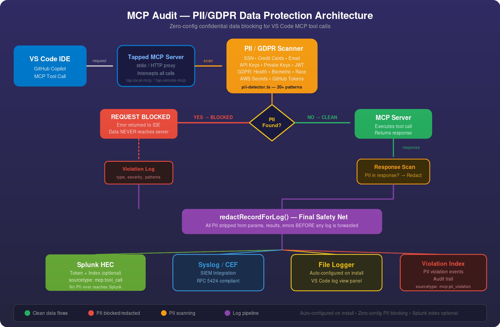

# MCP Audit by Agentity

[](https://marketplace.visualstudio.com/items?itemName=agentity.mcp-audit-extension)
[](https://opensource.org/licenses/MIT)
[](#pii--gdpr-protection)
[](#pii--gdpr-protection)

**Audit, log, and block PII/GDPR/confidential data in GitHub Copilot MCP tool calls — with zero configuration.**

## Table of Contents

- [Overview](#overview)
- [Architecture](#architecture)
- [Key Use Cases](#key-use-cases)
- [Installation](#installation)
  - [From the Command Line](#from-the-command-line)
  - [From the Visual Studio Code UI](#from-the-visual-studio-code-ui)
  - [From a .vsix File](#from-a-vsix-file)
- [Quick Start — Zero Configuration](#quick-start--zero-configuration)
- [PII / GDPR Protection](#pii--gdpr-protection)
  - [What Gets Detected](#what-gets-detected)
  - [How Blocking Works](#how-blocking-works)
  - [PII Detection Configuration](#pii-detection-configuration)
- [Configuration](#configuration)
  - [Log Forwarders](#log-forwarders)
  - [Splunk Configuration](#splunk-configuration)
  - [Secure Token Configuration](#secure-token-configuration)
- [Log Data Format](#log-data-format)
- [Limitations](#limitations)
- [Troubleshooting](#troubleshooting)
- [FAQ](#faq)
- [License](#license)
- [Contact](#contact)

## Overview

MCP Audit is a VS Code extension that provides **real-time security and compliance** for GitHub Copilot MCP tool calls. It transparently intercepts every MCP request and response, scans for confidential data, and blocks PII/GDPR violations **before they ever leave the IDE or reach your logging infrastructure**.

### What's New in v2.0

- **🛡 PII/GDPR Blocking** — Automatically detects and blocks 20+ categories of confidential data
- **🔒 Zero-Config Protection** — PII blocking activates immediately on install, no setup required
- **🧹 Log Redaction** — Safety-net redaction ensures no PII ever reaches Splunk, Syslog, or file logs
- **📊 Violation Logging** — Separate audit trail for all blocked PII/GDPR violations
- **⚙ Splunk Index Support** — Optional Splunk index and violation-specific sourcetype configuration

## Architecture

<p align="center">
  
</p>

The extension creates **tapped mirrors** of every configured MCP server. All tool calls flow through a multi-layer security pipeline:

1. **Intercept** — Tapped server captures the MCP request (stdio for local, HTTP proxy for remote)
2. **Scan Request** — PII/GDPR scanner analyzes all parameters before the request reaches the MCP server
3. **Block or Allow** — If PII is detected, the request is **blocked immediately** and an error is returned to the IDE. The data **never reaches the upstream MCP server**.
4. **Scan Response** — Clean requests proceed to the MCP server; responses are scanned for PII before returning to the IDE
5. **Redact Logs** — A final safety-net (`redactRecordForLog`) strips any remaining PII from log records before forwarding to Splunk/Syslog/File
6. **Forward** — Sanitized logs are forwarded to configured destinations (Splunk HEC, Syslog/CEF, local file)

## Key Use Cases

- **Data Loss Prevention** — Block SSNs, credit cards, API keys, private keys, and other secrets from leaking through MCP tool calls
- **GDPR Compliance** — Detect and block special category data: health, biometric, racial/ethnic origin, political opinions, religious beliefs, sexual orientation, criminal records
- **Security Auditing** — Comprehensive audit trail of all MCP tool interactions with violation tracking
- **Centralized Logging** — Aggregate sanitized MCP data into Splunk, Syslog, or SIEM platforms
- **Developer Troubleshooting** — Detailed logs with PII safely redacted for debugging

<!-- MCP Audit Demo Video -->
<p align="center">
  <video width="640" height="360" controls>
    <source src="https://storage.googleapis.com/mcp-audit-video/MCPAuditDemo-High.mp4" type="video/mp4">
    Your browser does not support the video tag.
  </video>
</p>

## Installation

> **Note:** This extension requires Visual Studio Code version 1.101 or newer.

### From the Command Line

```shell
code --install-extension agentity.mcp-audit-extension
```

### From the Visual Studio Code UI

1. Open Visual Studio Code
2. Navigate to the **Extensions** view (`Ctrl+Shift+X`)
3. Search for "**MCP Audit by Agentity**"
4. Click **Install**

### From a .vsix File

If you have the `.vsix` package file:

```shell
code --install-extension mcp-audit-extension-2.0.0.vsix
```

Or in VS Code: **Extensions** → **⋯** menu → **Install from VSIX…**

## Quick Start — Zero Configuration

**MCP Audit works immediately after installation.** No manual configuration is required.

On first activation, the extension automatically:

| What | Detail |
|:-----|:-------|
| **Enables PII/GDPR blocking** | All 20+ detection patterns are active |
| **Blocks confidential data** | Requests containing PII are rejected before reaching the MCP server |
| **Scans requests & responses** | Both directions are scanned |
| **Creates a file logger** | Tool call logs are saved locally for the VS Code log view panel |
| **Shows a welcome notification** | Confirms that protection is active |

Simply start using your `(tapped)` MCP servers — all data protection is handled automatically.

> **Optional:** Configure Splunk HEC, Syslog, or additional file loggers in **Settings → MCP Audit** to forward sanitized logs to your SIEM.

## PII / GDPR Protection

### What Gets Detected

The built-in scanner detects **20+ categories** of sensitive data:

| Category | Examples |
|:---------|:---------|
| **Identity** | Social Security Numbers (SSN), dates of birth |
| **Financial** | Credit card numbers (Visa, MasterCard, Amex, Discover), IBANs |
| **Contact** | Email addresses, phone numbers, IP addresses |
| **Credentials** | Passwords in config, API keys, private keys (RSA/EC/DSA) |
| **Cloud Secrets** | AWS access keys, GitHub personal access tokens |
| **Tokens** | JWTs (JSON Web Tokens) |
| **GDPR Special Categories** | Health/medical data, biometric data, racial/ethnic origin, political opinions, religious/philosophical beliefs, trade union membership, sexual orientation, criminal records |

### How Blocking Works

```
Request with SSN "123-45-6789"
        │
        ▼
  ┌─────────────┐
  │  PII Scan   │──── PII FOUND ──── ⛔ BLOCKED (never reaches MCP server)
  └─────────────┘                            │
                                   Violation logged with details
                                   Error returned to IDE
```

- **Request blocking**: PII in tool call parameters → request blocked, error returned to IDE
- **Response redaction**: PII in tool response → redacted before returning to IDE
- **Log safety net**: Any remaining PII in log records → stripped before forwarding to Splunk/Syslog

### PII Detection Configuration

All settings are under `mcpAudit.piiDetection.*` in VS Code settings:

| Setting | Type | Default | Description |
|:--------|:-----|:--------|:------------|
| `enabled` | boolean | `true` | Enable/disable PII detection globally |
| `blockOnDetection` | boolean | `true` | Block requests when PII is found (if `false`, only logs) |
| `scanRequests` | boolean | `true` | Scan outgoing tool call parameters |
| `scanResponses` | boolean | `true` | Scan incoming tool responses |
| `blockingSeverity` | string | `"high"` | Minimum severity to trigger blocking: `"critical"`, `"high"`, `"medium"`, `"low"` |
| `excludePatterns` | array | `[]` | Pattern names to exclude (e.g., `["email", "phone"]`) |
| `gdprKeywordDetection` | boolean | `true` | Enable GDPR special category keyword detection |
| `logViolations` | boolean | `true` | Log violation events to forwarders |

**Example — Disable blocking but keep logging:**
```json
{
  "mcpAudit.piiDetection.blockOnDetection": false
}
```

**Example — Exclude email and phone detection:**
```json
{
  "mcpAudit.piiDetection.excludePatterns": ["email", "phone"]
}
```

## Configuration

### Log Forwarders

Configure log forwarders in `mcpAudit.forwarders`. A default file logger is auto-created on first install.

<details><summary>Full reference for forwarders configuration</summary>

#### Common Properties

| Property  | Type      | Description |
|:----------|:----------|:------------|
| `name`    | `string`  | A unique, user-friendly name for this forwarder |
| `enabled` | `boolean` | Enable or disable this specific forwarder |
| `type`    | `string`  | `HEC`, `CEF`, or `FILE` |

#### HEC Forwarder (`type: "HEC"`)

| Property         | Type     | Description |
|:-----------------|:---------|:------------|
| `url`            | `string` | Full URL of the Splunk HEC endpoint |
| `tokenSecretKey` | `string` | Key to look up the HEC token from the secret store |
| `sourcetype`     | `string` | (Optional) Sourcetype for events |
| `index`          | `string` | (Optional) Splunk index to send data to |

#### CEF/Syslog Forwarder (`type: "CEF"`)

| Property   | Type      | Description |
|:-----------|:----------|:------------|
| `host`     | `string`  | IP or hostname of the Syslog server |
| `port`     | `integer` | Port number |
| `protocol` | `string`  | `tcp`, `udp`, or `tls` |

#### File Forwarder (`type: "FILE"`)

| Property | Type     | Description |
|:---------|:---------|:------------|
| `path`   | `string` | Absolute path to the log file |
</details>

### Splunk Configuration

Optional Splunk-specific settings under `mcpAudit.splunk.*`:

| Setting | Type | Default | Description |
|:--------|:-----|:--------|:------------|
| `defaultIndex` | string | `""` | Default Splunk index for all events (blank = Splunk default) |
| `violationIndex` | string | `""` | Separate index for PII violation events (blank = uses `defaultIndex`) |
| `violationSourcetype` | string | `"mcp:pii_violation"` | Sourcetype for violation events |

> **Note:** Splunk index fields are **optional**. Leave blank to use your Splunk instance's default index. The extension works fully without any Splunk configuration.

<details><summary>Example configuration with Splunk and PII protection</summary>

```json
{
  "mcpAudit.forwarders": [
    {
      "name": "Splunk Production",
      "enabled": true,
      "type": "HEC",
      "url": "https://splunk.company.com:8088/services/collector",
      "tokenSecretKey": "prod-hec-token"
    },
    {
      "name": "Default File Logger",
      "enabled": true,
      "type": "FILE",
      "maxSize": "10M",
      "path": "/home/user/.vscode/mcp-tool-calls.log"
    }
  ],
  "mcpAudit.splunk.defaultIndex": "mcp_audit",
  "mcpAudit.splunk.violationIndex": "mcp_violations",
  "mcpAudit.piiDetection.enabled": true,
  "mcpAudit.piiDetection.blockOnDetection": true,
  "mcpAudit.piiDetection.blockingSeverity": "medium"
}
```
</details>

### Secure Token Configuration

<details><summary>How to distribute secret tokens securely</summary>

To avoid storing sensitive tokens in settings files, the HEC forwarder uses a secure, one-time mechanism. Create a temporary `mcp-tap-secrets.json` file:

- **Windows:** `%APPDATA%\Code\User\mcp-tap-secrets.json`
- **macOS:** `~/Library/Application Support/Code/User/mcp-tap-secrets.json`
- **Linux:** `~/.config/Code/User/mcp-tap-secrets.json`

```json
{ "prod-hec-token": "YOUR-SECRET-HEC-TOKEN-VALUE" }
```

On the next launch, the extension reads the token, moves it to VS Code's encrypted secret storage, and deletes the file.
</details>

### API Key

On [audit.agentity.com](https://audit.agentity.com), you can retrieve a free API key. With a valid API key, the extension logs the full contents of results, errors, and request parameters. Distribute the key via the secrets JSON file using the key `API_KEY`:

```json
{ "API_KEY": "GENERATED_JWT" }
```

## Log Data Format

<details><summary>Reference for full MCP tool call log format</summary>

| Field             | Type     | Description |
|:------------------|:---------|:------------|
| `mcpServerName`   | `string` | MCP server that handled the call |
| `toolName`        | `string` | Tool that was called |
| `agentId`         | `string` | Anonymous machine identifier |
| `hostName`        | `string` | Machine hostname |
| `ipAddress`       | `string` | Local IP address |
| `timestamp`       | `string` | ISO 8601 timestamp |
| `params`          | `object` | Tool call arguments (**PII redacted**) |
| `_meta`           | `object` | MCP server metadata |
| `result`          | `any`    | Tool result (**PII redacted**). Requires API key. |
| `error`           | `any`    | Error details (**PII redacted**). Requires API key. |
| `piiViolation`    | `object` | Present if PII was detected — includes patterns, severity, action taken |

</details>

<details><summary>Example log records</summary>

### Clean Tool Call

```json
{
  "toolName": "terminal.runCommand",
  "mcpServerName": "Terminal",
  "agentId": "a1b2c3d4-e5f6-7890-1234-567890abcdef",
  "hostName": "dev-machine-01",
  "ipAddress": "192.168.1.100",
  "timestamp": "2025-07-27T10:30:00.123Z",
  "params": { "command": "ls -la" },
  "result": { "stdout": "total 8\n...", "exitCode": 0 }
}
```

### Blocked PII Violation

```json
{
  "toolName": "database.query",
  "mcpServerName": "DB Server",
  "timestamp": "2025-07-27T10:31:00.456Z",
  "params": "[REDACTED — PII detected: ssn, credit_card]",
  "piiViolation": {
    "action": "blocked",
    "patternsFound": ["ssn", "credit_card"],
    "maxSeverity": "critical",
    "matchCount": 2,
    "direction": "request"
  }
}
```
</details>

## Limitations

- **Forked IDEs**: Compatibility with Cursor, Windsurf, etc. depends on their adoption of VS Code 1.101+
- **Server Disabling**: If a developer uses the original (non-tapped) server, calls will not be audited or scanned for PII
- **Local Server Conflicts**: The tap spawns an additional process, which may conflict with exclusive resource bindings
- **Tool Call Limit**: GitHub Copilot's 128 tool call limit means a maximum of 64 audited calls per interaction
- **Configuration Restart**: Secret input variables may require a VS Code restart

## Troubleshooting

<details><summary>Step-by-step troubleshooting guide</summary>

### 1. Confirm You Are Using a `(tapped)` Server

Auditing and PII protection are only active for tapped servers. Check the server name in GitHub Copilot's tool call prompt.

### 2. Check Logs for Errors

Open the VS Code **Output** panel (`Ctrl+Shift+U`):
- **`MCP Audit Extension`** — Extension initialization, forwarder status, PII detection status
- **`MCP Server: <Name> (tapped)`** — Individual tool call logs and PII scan results

### 3. Verify PII Detection Status

Run **Settings → MCP Audit** and confirm:
- `piiDetection.enabled` is `true`
- `piiDetection.blockOnDetection` is `true`

### 4. Get in Touch

- [Open an Issue on GitHub](https://github.com/agentborisdanilovich/mcp-audit-extension/issues)
- Email: [support@agentity.com](mailto:support@agentity.com)
</details>

## FAQ

- **Does PII blocking work without Splunk?**
  Yes. PII blocking is completely independent of log forwarders. It works out of the box with zero configuration.

- **What data is sent to the Agentity cloud?**
  Only an anonymous registration event (hashed agent ID + API key) for usage statistics. No tool call data or user content is sent.

- **Can I disable blocking but keep logging violations?**
  Yes. Set `mcpAudit.piiDetection.blockOnDetection` to `false`. PII will be logged but not blocked.

- **Is the Splunk index required?**
  No. All Splunk index fields are optional. Leave blank to use your Splunk instance's default index.

- **What is the performance impact?**
  Minimal. PII scanning uses optimized regex patterns and log forwarding is asynchronous.

## License

This project is licensed under the MIT License. See the [LICENSE](LICENSE) file for details.

## Contact

For questions, support, or feature requests, please contact us at [support@agentity.com](mailto:support@agentity.com).